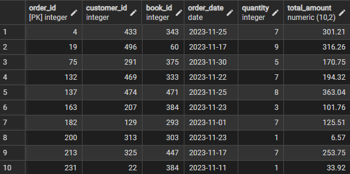

# bookstore-sql-project
A relational database project built using PostgreSQL to simulate a bookstore management system. This project demonstrates database design, SQL queries (basic to advanced), and business insights from a bookstore dataset.

## 📌 Features

+ **Database Design** – Tables for Books, Customers, Orders, etc.
+ **Basic SQL Queries** – Filtering, sorting, and retrieving data.
+ **Intermediate SQL** – Aggregations, GROUP BY, and JOIN operations.
+ **Advanced SQL** – Window functions, subqueries, and analytics queries.
+ **Data Analysis** – Insights like best customers, top-selling books, and revenue trends.

```
bookstore-sql-project/
│
├── README.md
├── schema.sql
├── data/
│   ├── books.csv
│   ├── customers.csv
│   └── orders.csv
│
├── queries/
│   ├── basic_queries.sql    
│   ├── advanced_queries.sql  
│
├── results/
│   ├── screenshots/
│   └── sample_outputs.txt
│
└── LICENSE
```
## 🗄️ Database Schema
```SQL
create table books(
  book_ID serial primary key,
  Title varchar(100),
  Author varchar(100),
  Gener varchar(50),
  Published_Year int,
  price numeric(10,2),
  Stock int
);

create table customers(
	customer_id serial primary key,
	name varchar(100),
	email varchar(100),
	phone varchar(15),
	city varchar(100),
	country varchar(100)
);

create table orders(
	order_id serial primary key,
	customer_id INT references customers(customer_id), 
	book_id INT references books(book_id),
	order_date date,
	quantity int,
	total_amount numeric(10,2)
);

```
## Data Import
```SQL
--copy books table
copy
books(book_id, title, author, gener, published_year, price, stock)
from 'D:\Data Analytics\SQL\YT Learning\ST - SQL ALL PRACTICE FILES\All Excel Practice Files\Books.csv'
delimiter ','
csv header;

--copy customers table
copy 
customers(customer_id, name, email, phone, city, country)
from 'D:\Data Analytics\SQL\YT Learning\ST - SQL ALL PRACTICE FILES\All Excel Practice Files\Customers.csv'
delimiter ','
csv header;

--copy orders table (Linking table)
copy 
orders(order_id, customer_id, book_id, order_date, quantity, total_amount)
from 'D:\Data Analytics\SQL\YT Learning\ST - SQL ALL PRACTICE FILES\All Excel Practice Files\Orders.csv'
delimiter ',' csv header;
```
## ⚡ Example Queries
### 🔹 Basic Queries
```SQL
--Q) Show orders placed in November 2023.
select * from orders 
where order_date between '2023-11-01' and '2023-11-30';

--using EXTRACT
select * from orders
where extract(month from order_date) = 11
	and extract(year from order_date)= 2023;
--using DATE_TRUNC
select * from orders
where order_date >= date '2023-11-01' and
	  order_date <= date '2023-11-30';
```

### 🔹 Advance Queries
```SQL
--Q) Calculate the stock remaining after fulfilling all orders.
select b.book_id, b.title, b.stock, COALESCE(sum(o.quantity),0) AS order_quantity,
       b.stock - COALESCE(sum(o.quantity),0) AS stock_left
from books b
LEFT JOIN orders o on b.book_id = o.book_id
group by b.book_id;
```
## 📊 Sample Output (Screenshots)


## 🛠️ Tech Stack

 + **Database**: PostgreSQL

+ **Client Tool**: pgAdmin 4

## 🚀 How to Run
#### 1.Clone this repo
```bash
git clone https://github.com/Pranav2290/bookstore-sql-project.git
```
#### 2.Create database in PostgreSQL
```sql
CREATE DATABASE bookstore;
```
#### 3.Run schema
```bash
psql -U postgres -d bookstore -f schema.sql
```
#### 4.Import data from /data folder.

#### 5.Execute queries from /queries folder.

## 📈 Learnings
Through this project, I practiced and understood:
+ Designing a relational database schema.
+ Writing SQL queries (CRUD, aggregations, joins, window functions).
+ Extracting business insights from data.
+ Using GitHub for version control & project documentation.


